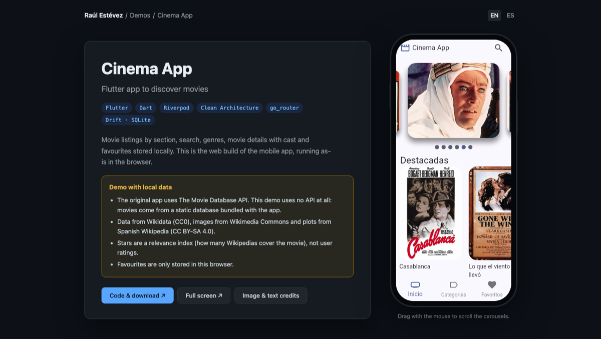

# Cinema App · Web Demo

> [!IMPORTANT]
> **This is not the main Cinema App repository.**
> This repository only contains the **web demo** published on my website.
> The full project (source code, the original version using the TMDB API, and instructions to download and run the app) lives here:
>
> **➡️ [RaulEstevezA/Cinema_App](https://github.com/RaulEstevezA/Cinema_App)**

**▶️ Live demo:** [raulesteveza.github.io/demos/Cinema_App](https://raulesteveza.github.io/demos/Cinema_App/)

- 🇬🇧 **English:** [About this demo repository](./README_en.md)
- 🇪🇸 **Español:** [Sobre este repositorio de demo](./README_es.md)

  

## What is this repository?

A copy of Cinema App adapted to run **in the browser, on GitHub Pages, without any API**:

- Movie data comes from a **static database bundled with the app**, built from free-licensed sources (Wikidata, Wikimedia Commons and Wikipedia) instead of the TMDB API.
- The app is shown inside a **phone frame** on desktop and full screen on mobile.
- Every push to `main` is **built and deployed automatically** to my website with GitHub Actions.

The app architecture (Clean Architecture, Riverpod, go_router, Drift) is the same as in the main repository. Only the data source and the web-specific details change.

## Developer

**Raul Estevez**

- [Personal Website](https://raulesteveza.github.io/)
- [LinkedIn Profile](https://www.linkedin.com/in/raulesteveza/)
