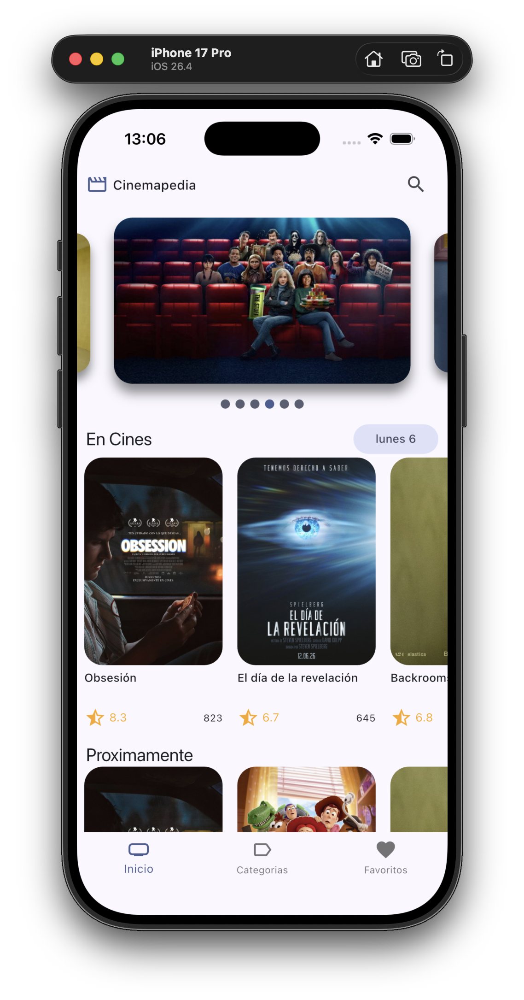
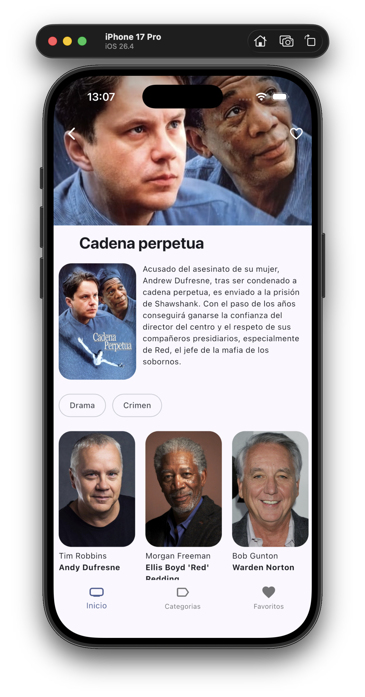
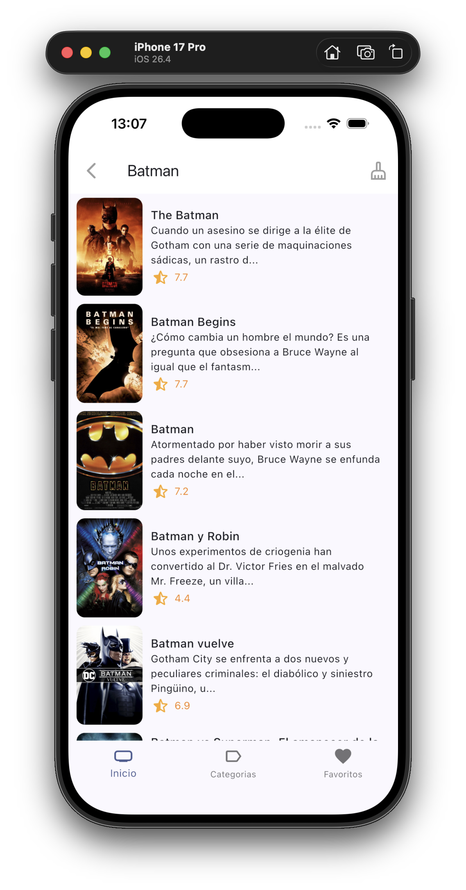
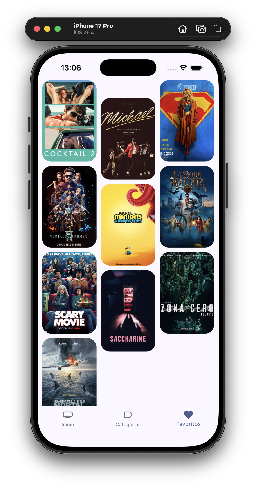
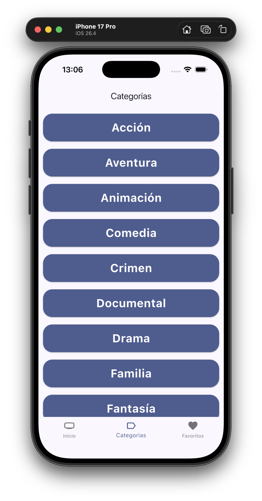
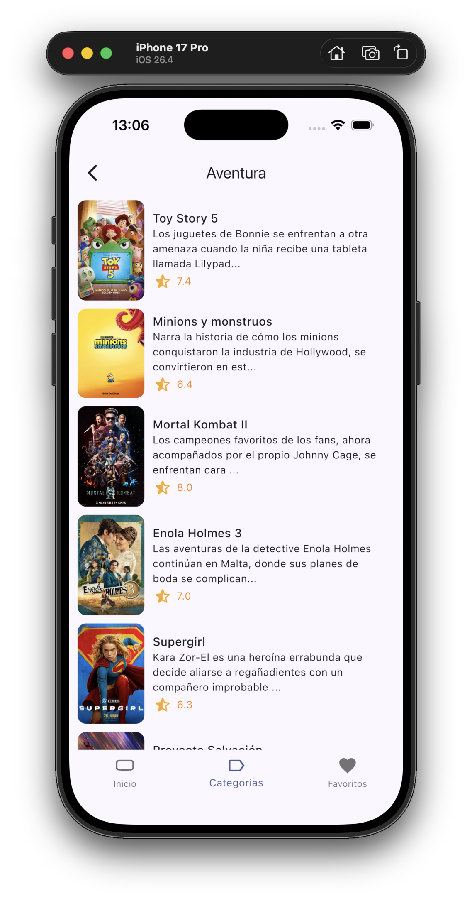
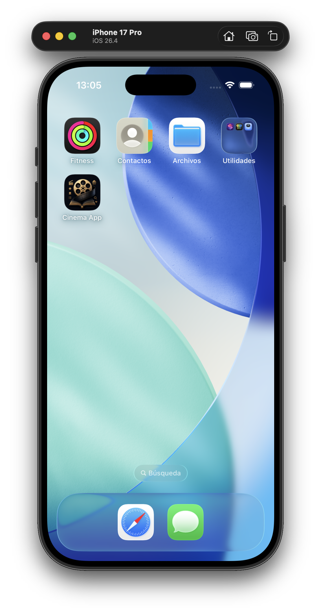

# Cinema App - Full Project Overview

<p align="center">
  <a href="https://youtube.com/shorts/67coTqVxwA4">
    
  </a>
</p>

<p align="center">
  <a href="https://youtube.com/shorts/67coTqVxwA4">Watch the video demo on YouTube</a>
</p>

## Project Status

**Snapshot updated:** `2026-07-06`  
**Branch:** `main`  
**Last documented commit:** `07897fe` - "Refactor code structure for improved readability and maintainability"  
**Status:** completed app, with all main screens and flows implemented.

Commit `239f87d` marks the end of the course-guided part of the project. Everything after that point, including genres/categories, navigation by genre, the app icon and animations, was developed independently.

## Overview

Cinema App, internally branded in the UI as **Cinemapedia**, is a Flutter movie discovery app powered by [The Movie Database (TMDB)](https://www.themoviedb.org). It uses Clean Architecture, Riverpod for state management and Drift with SQLite for local favorite movie persistence.

A central technical focus of the app is the use of external APIs and the mapping of remote data into stable domain entities. TMDB responses are received as DTOs, transformed by dedicated mappers and exposed to the presentation layer through repository interfaces, keeping the UI independent from the API response shape.

## Technologies and Dependencies

**SDK:** Dart `^3.11.4` / Flutter

| Package | Version | Purpose |
|---|---:|---|
| flutter_riverpod | ^3.3.1 | State management |
| go_router | ^17.2.3 | Navigation with `StatefulShellRoute` |
| dio | ^5.9.2 | HTTP client for API requests |
| drift | ^2.34.0 | SQLite ORM and local persistence |
| drift_flutter | ^0.3.0 | Flutter adapter for Drift |
| drift_dev | ^2.34.0 | Drift code generation |
| flutter_staggered_grid | ^0.1.2 | `MasonryGridView` / `SliverMasonryGrid` |
| path_provider | ^2.1.6 | System directory lookup |
| animate_do | ^5.1.0 | Animations such as `FadeIn`, `FadeInRight` and `SpinPerfect` |
| card_swiper | ^3.0.1 | Featured movie carousel |
| flutter_dotenv | ^6.0.1 | `.env` environment variables |
| intl | ^0.20.2 | Date formatting in Spanish |
| flutter_lints | ^6.0.0 | Linting rules |
| flutter_launcher_icons | ^0.14.4 | Android/iOS app icon generation |
| mocktail | ^1.0.5 | Unit test mocks |

## Data Source

- **API:** The Movie Database (TMDB) - https://www.themoviedb.org
- **Base URL:** `https://api.themoviedb.org/3`
- **Authentication:** API key through the `api_key` query parameter, stored in `.env` as `THE_MOVIEDB_KEY`
- **Language:** `language=es-ES` in all requests
- **Image CDN:** `https://image.tmdb.org/t/p/w500{path}`

The app does not pass raw API responses directly to the UI. Each response is parsed into infrastructure models and converted into domain entities such as `Movie`, `Actor` and `Genres`. This keeps API-specific field names, nullable values and image path normalization contained inside the infrastructure layer.

### API Endpoints

| Endpoint | Purpose |
|---|---|
| `/movie/now_playing` | Now playing movies |
| `/movie/popular` | Popular movies |
| `/movie/upcoming` | Upcoming releases |
| `/movie/top_rated` | Top rated movies |
| `/movie/{id}` | Full movie details |
| `/search/movie` | Movie search |
| `/movie/{id}/credits` | Cast and crew |
| `/genre/movie/list` | Movie genre list |
| `/discover/movie?with_genres=` | Movies filtered by genre, with pagination |

## Architecture

The project uses Clean Architecture split into domain, infrastructure and presentation layers:

```text
lib/
├── config/
│   ├── constants/        # Environment variables and API key access
│   ├── database/         # Drift AppDatabase and FavoriteMovies schema
│   ├── helpers/          # HumanFormats
│   ├── router/           # Go Router with 3-tab StatefulShellRoute
│   └── theme/            # Material Design 3, primary color #2862F5
├── domain/
│   ├── datasources/      # Movies, actors, local storage and genres contracts
│   ├── entities/         # Movie, Actor and Genres
│   └── repositories/     # Repository interfaces
├── infrastructure/
│   ├── datasources/      # TMDB, Drift and genres data sources
│   ├── mappers/          # MovieMapper, ActorMapper and GenreMapper
│   ├── models/           # TMDB DTOs
│   └── repositories/     # Repository implementations
└── presentation/
    ├── providers/        # Riverpod providers for movies, storage and genres
    ├── screens/          # HomeScreen, MovieScreen and MoviesByGenreScreen
    ├── views/            # HomeView, FavoritesView and CategoriesView
    ├── widgets/          # Movie and shared UI widgets
    └── delegate/         # SearchMovieDelegate
```

### API Integration and Data Mapping

The API and mapping flow is one of the most important parts of the project:

- Datasources call TMDB endpoints with Dio and environment-based API key configuration.
- Infrastructure models represent the remote response shape returned by TMDB.
- Mappers convert those models into app-level domain entities.
- Repositories expose clean methods to the rest of the app without leaking API details.
- Riverpod providers consume repositories and deliver ready-to-render state to the UI.

This pattern is used for movies, movie details, actors/cast and genres. It also makes pagination, caching and future API changes easier to manage because the remote contract is isolated from the presentation layer.

The app icon source is `assets/icon/icon.png` (`1254x1254`) and the `flutter_launcher_icons` configuration lives in `pubspec.yaml`. The generated assets target Android and iOS.

## Local Database

**File:** `lib/config/database/favorite_database.dart`  
**Database file name:** `my_database`, stored through `getApplicationSupportDirectory`.

### `FavoriteMovies`

| Column | Type | Notes |
|---|---|---|
| id | INTEGER | Autoincrement primary key |
| movie_id | INTEGER | TMDB movie ID |
| backdrop_path | TEXT | Backdrop image path |
| original_title | TEXT | Original movie title |
| poster_path | TEXT | Poster image path |
| title | TEXT | Localized movie title |
| vote_average | REAL | Defaults to `0.0` |

Database access code is generated with `drift_dev` into `favorite_database.g.dart`.

## Domain Entities

| Entity | Fields |
|---|---|
| Movie | `id`, `title`, `originalTitle`, `originalLanguage`, `overview`, `popularity`, `releaseDate`, `voteAverage`, `voteCount`, `posterPath`, `backdropPath`, `genreIds`, `adult`, `video` |
| Actor | `id`, `name`, `profilePath`, `character` |
| Genres | `id`, `genre` |

## Implemented Features

### 1. Home Screen

<p align="center">
  
</p>

`HomeScreen` is the outer scaffold. It contains the Go Router `StatefulNavigationShell` and the custom bottom navigation. `HomeView` uses a `SliverAppBar` with the custom app bar, the Cinemapedia logo text and the search icon.

The screen includes an auto-playing slideshow with the first 6 now playing movies, plus four horizontal lists with infinite pagination:

| List | Provider |
|---|---|
| Now Playing | `nowPlayingMoviesProvider` |
| Upcoming | `upcomingMoviesProvider` |
| Popular | `popularMoviesProvider` |
| Top Rated | `topRatedMoviesProvider` |

A `FullScreenLoader` is shown during the initial load, with rotating messages every 1.5 seconds.

### 2. Movie Details

<p align="center">
  
</p>

**Route:** `/movie/:id`

The movie detail screen uses an expanded `SliverAppBar` with the movie backdrop and a translucent gradient. It displays the poster, title, overview, genre chips, favorite toggle and a horizontal cast list with actor photos, names and characters.

The favorite button is connected to `toggleFavoriteMovies` and `isFavoriteMovieProvider`. The favorite status provider uses `.autoDispose` to release memory when leaving the detail screen. The UI also uses `FadeIn` and `FadeInRight` animations.

### 3. Search

<p align="center">
  
</p>

Search uses Flutter's native `SearchDelegate`, opened from the app bar icon. It includes:

- 500 ms debouncing with `Timer`.
- `StreamController` for asynchronous search results.
- `SpinPerfect` loading indicator while searching.
- Result rows with poster, title, 100-character overview preview and rating.

### 4. Favorites

<p align="center">
  
</p>

`FavoritesView` is a `ConsumerStatefulWidget`. It loads the first page in `initState`, shows an empty state with a `favorite_border` icon when there are no favorites and renders data through `MoviesMasonry`.

`MoviesMasonry` is a `StatefulWidget` built with a `CustomScrollView`, a collapsible top padding section and a `SliverMasonryGrid.count` with 3 columns. Its scroll listener is registered through `addPostFrameCallback` to avoid premature loading when `maxScrollExtent == 0` on the first frame.

It also checks in `didUpdateWidget` whether content fills the viewport. If it does not, it keeps requesting the next page until the content overflows or there are no more results. Infinite scrolling triggers when `pixels + 200 >= maxScrollExtent`, with `isLoading` and `isLastPage` guards to avoid duplicated requests.

### 5. Infinite Pagination

Remote pagination is handled by `MovieHorizontalListview`, which detects the end of the horizontal scroll and calls each provider's `loadNextPage()`.

Local favorite pagination is handled by `StorageMoviesNotifier.loadNextpage()` with `limit: 10` and `offset: page * 10`. Results are accumulated in a `Map<int, Movie>` to deduplicate movies by ID.

### 6. Remote Data Cache

- `movieInfoProvider` caches movie details by ID in a `Map<String, Movie>`.
- `actorsByMovieProvider` caches cast lists by movie ID in a `Map<String, List<Actor>>`.

### 7. Categories and Genres

<p align="center">
  
</p>

<p align="center">
  
</p>

Genres are loaded by `AllGenresDatasource` through `/genre/movie/list`, parsed with the `GenreMovies` / `Genre` model and mapped to the `Genres` entity through `GenreMapper`.

The provider setup includes `genresRepositoryProvider`, which builds `GenreRepositoryImp`, and `genresProvider`, a `FutureProvider<List<Genres>>` that fetches the list once because the genre list does not need pagination.

`CategoriesView` is a `ConsumerWidget` that renders a vertical `ListView.builder` with a wide `Card` for each genre. Each card uses bold large text, the theme primary color and a `FadeInRight` animation.

Tapping a genre navigates with `context.push('/categories/genre/:id', extra: genre.genre)` to `MoviesByGenreScreen`.

Movies by genre are fetched through `getMoviesByGenre(genreId, {page})`, added to the movies datasource contract, implemented by `MoviedbDatasource` through `/discover/movie?with_genres=`, exposed by `MovieRepositoryImp` and managed by `moviesByGenreProvider`.

`MoviesByGenreScreen` is a `ConsumerStatefulWidget`. It renders a vertical `ListView.builder` of `MovieVerticalListview` rows with poster, title, truncated overview and rating. It supports infinite pagination with a `ScrollController`, using the same `pixels + 200 >= maxScrollExtent` threshold, and opens `/movie/:id` when a row is tapped.

### 8. Tab Transition Animations

`HomeScreen` was changed from `StatelessWidget` to `StatefulWidget`. In `didUpdateWidget`, when `navigationShell.currentIndex` changes, the shell briefly fades out with `Duration.zero` and fades back in over 200 ms through `AnimatedOpacity` and `addPostFrameCallback`.

### 9. App Icon

<p align="center">
  
</p>

The source image is `assets/icon/icon.png` (`1254x1254`). The icon is configured with `flutter_launcher_icons` in `pubspec.yaml` and generated with:

```bash
dart run flutter_launcher_icons
```

The command overwrites Android `mipmap-*/ic_launcher.png` assets and the iOS `AppIcon.appiconset`.

## State Management

| Provider | Type | Purpose |
|---|---|---|
| movieRepositoryProvider | Provider | Movie repository singleton |
| nowPlayingMoviesProvider | StateNotifierProvider | Now playing list with pagination |
| popularMoviesProvider | StateNotifierProvider | Popular movie list with pagination |
| upcomingMoviesProvider | StateNotifierProvider | Upcoming release list with pagination |
| topRatedMoviesProvider | StateNotifierProvider | Top rated list with pagination |
| moviesSlideshowProvider | Provider | First 6 now playing movies |
| initialLoadingProvider | Provider | Boolean that is true while any main list is empty |
| movieInfoProvider | StateNotifierProvider | Cached movie details by ID |
| actorsRepositoryProvider | Provider | Actor repository singleton |
| actorsByMovieProvider | StateNotifierProvider | Cached actors by movie ID |
| searchQueryProvider | StateProvider<String> | Current search query |
| searchedMoviesProvider | StateNotifierProvider | Search results |
| localStorageRepositoryProvider | Provider | Local Drift repository singleton |
| favoriteMoviesProvider | StateNotifierProvider | Paginated favorites as `Map<int, Movie>` |
| isFavoriteMovieProvider | FutureProvider.family<bool, int> | Checks whether a movie is favorite |
| genresRepositoryProvider | Provider | Genre repository singleton |
| genresProvider | FutureProvider<List<Genres>> | Full genre list, loaded once |
| moviesByGenreProvider | StateNotifierProvider.family<MoviesNotifier, List<Movie>, int> | Movies filtered by `genreId`, with pagination |

## Navigation

Navigation uses `StatefulShellRoute.indexedStack` with 3 branches. `HomeScreen` acts as the outer shell.

| Route | Tab | Widget |
|---|---|---|
| `/` | 0 - Home | `HomeView` |
| `/categories` | 1 - Categories | `CategoriesView` |
| `/favorites` | 2 - Favorites | `FavoritesView` |
| `/movie/:id` | Nested under branch 0 | `MovieScreen` |
| `/categories/genre/:id` | Nested under branch 1 | `MoviesByGenreScreen`, receiving `genreName` through `extra` |

## Setup

1. Copy `.env.template` to `.env`.
2. Add your TMDB key:

```env
THE_MOVIEDB_KEY=your_tmdb_api_key
```

3. Install dependencies:

```bash
flutter pub get
```

4. Regenerate database code if the Drift schema changes:

```bash
dart run build_runner build
```

5. Run the app:

```bash
flutter run
```

## Main README

[Link to the main README.md](./README.md)
